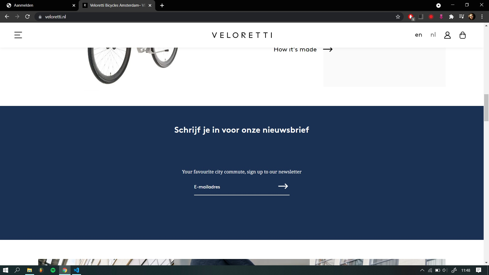

# Procesverslag
Markdown is een simpele manier om HTML te schrijven.  
Markdown cheat cheet: [Hulp bij het schrijven van Markdown](https://github.com/adam-p/markdown-here/wiki/Markdown-Cheatsheet).

Nb. De standaardstructuur en de spartaanse opmaak van de README.md zijn helemaal prima. Het gaat om de inhoud van je procesverslag. Besteedt de tijd voor pracht en praal aan je website.

Nb. Door *open* toe te voegen aan een *details* element kun je deze standaard open zetten. Fijn om dat steeds voor de relevante stuk(ken) te doen.

## Jij

uitwerken voor kick-off werkgroep

### Auteur:
Mick Oost Lievense

#### Je startniveau:
Blauw

#### Je focus:
Responsive
 

## Je website

uitwerken voor kick-off werkgroep

### Je opdracht:
veloretti

#### Screenshot(s) van de eerste pagina (small screen): 
Homepagina 

#### Screenshot(s) van de tweede pagina (small screen):
hier de naam van de pagina  

 

## Breakdownschets (week 1)

uitwerken na afloop 2e werkgroep

### de hele pagina: 

### dynamisch deel (bijv menu): 

### wellicht nog een dynamisch deel (bijv filter): 

## Voortgang 1 (week 2)

uitwerken voor 1e voortgang

### Stand van zaken
In de eerste week was ik nog gewisseld van website omdat het toch een te lastig iets was om na te maken.

### Agenda voor meeting
samen met je groepje opstellen

Mick: Tijdens het eerste voortgang gesprek was ik al van mijn eerste website afgestapt. Eerst zou ik de website van oneplus gaan maken. Maar nu zou ik een google website na gaan maken. Ik wilde het vooral hebben over het semantische schrijven, ik begreep nog niet zo goed hoe dat werkte.

### Verslag van meeting
hier na afloop snel de uitkomsten van de meeting vastleggen

- Semantisch schrijven; zonder id's en classes.
- De website is niet goed responsive

## Voortgang 2 (week 3)

uitwerken voor 2e voortgang

### Stand van zaken
Ik had al een hoop aan mn google website gedaan. Alleen was het niet de juiste voor mij. Tijdens de les was ik namelijk weer van website geswitcht.
Nu ging ik werken aan mijn veloretti website.

### Agenda voor meeting
samen met je groepje opstellen

Mick: Hoe lijn ik mn menu beter uit. Hoe kan mn code nog semantischer.

### Verslag van meeting
hier na afloop snel de uitkomsten van de meeting vastleggen

- Let op de H1, H2 en 3tjes. gebruik ze niet door elkaar.
- Gebruik niet zomaar een article voor een section.

## Toegankelijkheidstest (week 4)

uitwerken na test in 8e voortgang

### Bevindingen
Lijst met je bevindingen die in de test naar voren kwamen:
Mijn site is eigenlijk best toegankelijk. Al komt dit waarschijnlijk ook omdat er niet heel veel interactie op plaats vindt. De echte velorettie website is best wel chaotisch, Dit komt door het onduidelijke menu en de vele linkjes etc.

#### Titel eerste bevinding
Hier korte omschrijving (met indien nodig een afbeelding)
Als je blind bent kun je nog best makkelijk door de website heen komen, al is het niet echt duidelijk of je nu in een menu balk zit te tabben of dat je op de pagina zelf bent.

Hier een omschrijving van hoe het opgelost kan worden (met indien nodig een afbeelding)
Om dit op te lossen moet ik meer alt teksten aan de knoppen en andere interactieve delen van de site hangen. Zo hoort een blind iemand duidelijker waar hij of zij is.

#### Titel tweede bevinding. 
Hier korte omschrijving (met indien nodig een afbeelding)
Voor kleuren blinden is de website eigenlijk prima. Ik had best verwacht dat er iets mis zou gaan, maar het contrast is overal duidelijk en het is niet vervelend om te lezen of iets dergelijks.

Hier een omschrijving van hoe het opgelost kan worden (met indien nodig een afbeelding)
Er hoeft op dit gebied dus niet persee iets opgelost te worden.

#### Titel volgende bevinding. 
Hier korte omschrijving (met indien nodig een afbeelding)
De lastigste was naar mijn idee de bril waardoor je recht in je zicht een vlek had. Hier kon je gewoon niets mee zien. Er viel niets te focussen. Als je zo de blinde vlek hebt zie je alleen wat aan de zijkanten. 

Hier een omschrijving van hoe het opgelost kan worden (met indien nodig een afbeelding)
Ook voor deze beperking is het handig om een screenreader te gebruiken en zal de website dus duidelijker voor een screenreader moeten worden. Denk hierbij weer aan alt texten etc.

#### Titel nog een bevinding. 
Hier korte omschrijving (met indien nodig een afbeelding)
Deze bevinding kon natuurlijk niet achter blijven. De schok arm. Hiermee kon je bepaalde vormen van lichamelijke beperkingen na bootsen. Denk aan spasmes of parkinson. Het was erg moeilijk om met dit soort stuiptrekkingen de website te gebruiken. Los van het feit dat je arm all kanten op ging hielp het ook niet bij de concentratie. Het was erg moeilijk om de cursor op de juste plek te krijgen en vervolgens ook nog te klikken.

Hier een omschrijving van hoe het opgelost kan worden (met indien nodig een afbeelding)
Dit is een probleem dat mij erg moeilijk op te lossen leek. Maar na een tijdje brainstormen dacht ik, waarom zou je alles niet een tikkie groter maken. Zo is het veel makkelijker om de muis op de juiste plek te krijgen en zo maak je het makkelijker om de site te navigeren!

## Voortgang 3 (week 4)

uitwerken voor 3e voortgang

### Stand van zaken
Ik was deze week niet aanwezig bij het voortgangsgesprek. Dit kwam doordat ik mijn 2e vaccinatie had gehad en er erg ziek van was geworden. 

### Agenda voor meeting
samen met je groepje opstellen

Ik had het graag willen hebben over het uitlijnen van bepaalde items op mn website.

### Verslag van meeting
hier na afloop snel de uitkomsten van de meeting vastleggen

## Eindgesprek (week 5)

uitwerken voor eindgesprek

### Stand van zaken
hier dit ging goed & dit was lastig (neem ook screenshots op van delen van je website en code)

### Screenshot(s)

hier screenshot(s) van je eindresultaat

## Bronnenlijst

continu bijhouden terwijl je werkt

Nb. Wees specifiek ('css-tricks' als bron is bijv. niet specifiek genoeg).

1. https://codepen.io/mickoostlievense/pen/OJgwPQV (de regenboog knoppen)
2. https://www.veloretti.nl/
3. ...

